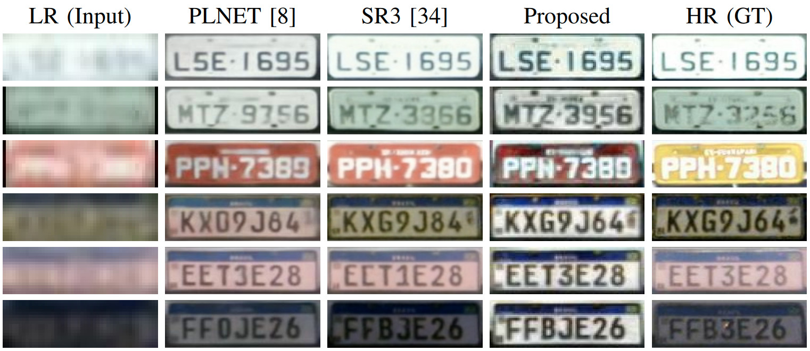
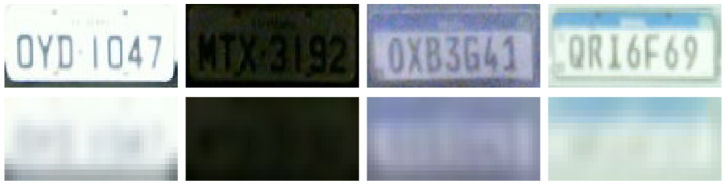

# Enhancing License Plate Super-Resolution: A Layout-Aware and Character-Driven Approach

We introduce a novel loss function, Layout and Character Oriented Focal Loss (LCOFL), which considers factors such as resolution, texture, and structural details, as well as the performance of the License Plate Recognition (LPR) task itself. We enhance character feature learning using deformable convolutions and shared weights in an attention module and employ a GAN-based training approach with an Optical Character Recognition (OCR) model as the discriminator to guide the super-resolution process. Our results show significant improvements in character reconstruction quality, outperforming two state-of-the-art methods in both quantitative and qualitative measures.



# LR-HR pairs generated from RodoSol-ALPR

The **High-Resolution (HR)** images used in our experiments were generated as follows. For each image from the [RodoSol-ALPR](https://github.com/raysonlaroca/rodosol-alpr-dataset) dataset, we first cropped the License Plate (LP) region using the annotations provided by the creators of the dataset. We then used the same annotations to rectify each LP image, making it more horizontal, tightly bounded, and easier to recognize. The rectified images serve as the HR images.

We generated **Low-Resolution (LR)** versions of each HR image by simulating the effects of an optical system with lower resolution. This was achieved by iteratively applying random Gaussian noise to each HR image until we reached the desired degradation level for a given LR image (i.e., SSIM < 0.1). We padded the LR and HR images to maintain the aspect ratio before resizing. This process was described in our [previous work](https://github.com/valfride/lpr-rsr-ext/).

Here are some HR-LR image pairs created:



### How to obtain the RodoSol-SR dataset

The RodoSol-SR dataset is released for academic research only and is free to researchers from educational or research institutes for **non-commercial purposes**.

To be able to download the dataset, please read [**this license agreement**](./media/license-agreement.pdf) carefully, fill it out and send it back to the second author ([rblsantos@inf.ufpr.br](mailto:rblsantos@inf.ufpr.br)) (who also manages access to the [RodoSol-ALPR](https://github.com/raysonlaroca/rodosol-alpr-dataset) dataset). **Your e-mail must be sent from a valid university account** (.edu, .ac or similar).

In general, you will receive a download link within 3-5 business days. Failure to follow the instructions may result in no response.

# Usage

## Testing
To test the model, ensure that the [config file](configs/cgnetV2_deformable_test.yaml) specifies the path to the .pth file, as shown in the example below:
```yaml
model:
  name: cgnetV2_deformable
  load: ./save/_cgnetV2_deformable_test/best_model_cgnetV2_deformable_Epoch_82.pth
  args:
    in_channels: 3
    out_channels: 3
```
Then, run the following command:
```
python3 test.py --config ./config/Sibgrapi_ablation/cgnetV2_deformable.yaml --save True 
```

## Training From Scratch
To train the model from scratch, set the following variables in the [config file](configs/cgnetV2_deformable.yaml) to null, as shown below:
```yaml
LOAD_PRE_TRAINED_OCR: null
resume: null
```
Then, execute the following command:
```
python3 ParallelNetTrain.py --config ./config/Sibgrapi_ablation/cgnetV2_deformable_test.yaml --save True
```

## Training On Custom Fataset
To train/FineTune the model on a custom dataset, ensure that a .txt file with the path to the cropped and rectified images is provided formated as the example bellow:
´´´txt
path/to/HR1_images.jpg;path/to/LR1_images.jpg;training
path/to/HR2_images.jpg;path/to/LR2_images.jpg;validation
path/to/HR3_images.jpg;path/to/LR3_images.jpg;testing
´´´

Also, modify the [config file](configs/cgnetV2_deformable.yaml) to include the path to the .txt within the text:

```yaml
train_dataset:
  dataset:
    name: parallel_training
    args:
      path_split: ./path/to/sample.txt
      phase: training
      
  wrapper:
    name: parallel_images_lp
    args:
      imgW: 48
      imgH: 16
      aug: True
      image_aspect_ratio: 3
      background: (127, 127, 127)
  batch: 2

val_dataset:
  dataset:
    name: parallel_training
    args:
      path_split: ./path/to/sample.txt
      phase: validation

  wrapper:
    name: parallel_images_lp
    args:
      imgW: 48
      imgH: 16
      aug: False
      image_aspect_ratio: 3
      background: (127, 127, 127)
  batch: 2
```

# Citation

If you use our code in your research, please cite:
* V. Nascimento, R. Laroca, R. O. Ribeiro, W. R. Schwartz, D. Menotti, “Enhancing License Plate Super-Resolution: A Layout-Aware and Character-Driven Approach,” in Conference on Graphics, Patterns and Images (SIBGRAPI), pp. 1-8, Sept. 2024.

```
@article{nascimento2024enhancing,
  title = {Enhancing License Plate Super-Resolution: A Layout-Aware and Character-Driven Approach},
  author = {V. {Nascimento} and R. {Laroca} and R. O. {Ribeiro} and W. R. {Schwartz} and D. {Menotti}},
  year = {2024},
  journal = {Conference on Graphics, Patterns and Images (SIBGRAPI)},
  volume = {},
  number = {},
  pages = {1-8},
  doi = {},
  issn = {},
}
```

You may also be interested in our [previous work](https://github.com/valfride/lpr-rsr-ext/). If you use the LR-HR image pairs we created for our experiments, please cite it:
* V. Nascimento, R. Laroca, J. A. Lambert, W. R. Schwartz, D. Menotti, “Super-Resolution of License Plate Images Using Attention Modules and Sub-Pixel Convolution Layers,” in *Computers & Graphics*, vol. 113, pp. 69-76, 2023. [[Science Direct]](https://doi.org/10.1016/j.cag.2023.05.005) [[arXiv]](https://arxiv.org/abs/2305.17313)

## Related publications

A list of all our papers on ALPR can be seen [here](https://scholar.google.com/scholar?hl=pt-BR&as_sdt=0%2C5&as_ylo=2018&q=allintitle%3A+plate+OR+license+OR+vehicle+author%3A%22David+Menotti%22&btnG=).

## Contact

Please contact Valfride Nascimento ([vwnascimento@inf.ufpr.br](mailto:vwnascimento@inf.ufpr.br)) with questions or comments.
